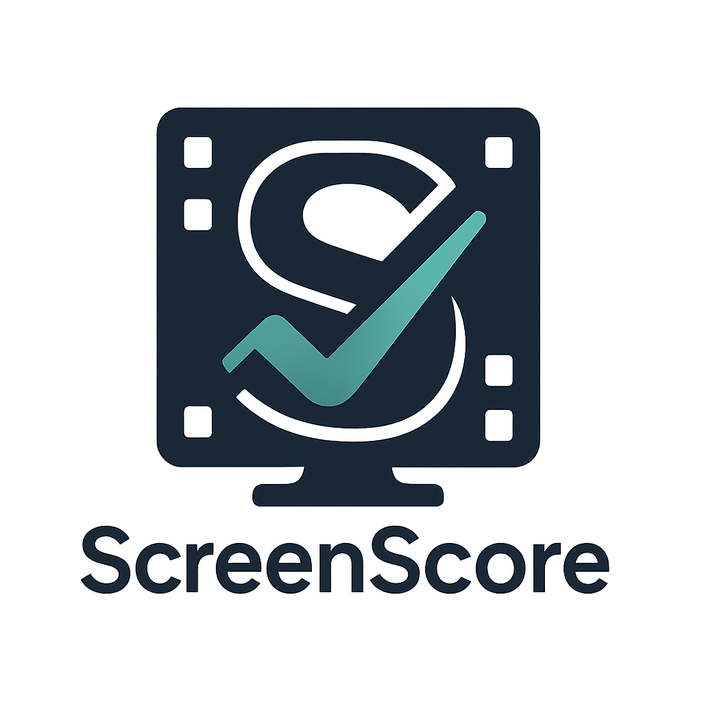

# ScreenScore - Screenplay Analysis Tool

<div align="center">
  
  <br/>
  <p><em>AI-powered screenplay analysis for film and TV producers</em></p>
</div>

[](https://opensource.org/licenses/MIT)
[](CONTRIBUTING.md)
[](https://discord.gg/your-server)

ScreenScore is an open-source tool that helps film and TV producers analyze screenplays for project greenlighting decisions. It runs entirely on your local machine, ensuring complete privacy for your screenplays.

## 🌟 Features

- 📝 Upload screenplays in PDF or TXT format
- 🤖 AI-powered analysis using local LLM (Mistral)
- 📊 Comprehensive analysis including:
  - Genre detection and confidence levels
  - Tone and themes
  - Character analysis and diversity
  - Production complexity assessment
  - Target audience and content rating
  - Overall greenlight recommendation
- 📈 Visual analysis reports
- 📤 Export to PDF or Markdown
- 🔒 Complete privacy - all processing happens locally

## 🚀 Quick Start

### Prerequisites

1. Install [Ollama](https://ollama.ai)
2. Install [Node.js](https://nodejs.org) (v18 or later)

### Installation

1. Clone the repository:
   ```bash
   git clone https://github.com/your-username/screenscore.git
   cd screenscore
   ```

2. Install dependencies:
   ```bash
   npm install
   ```

3. Start Ollama and pull the Mistral model:
   ```bash
   ollama pull mistral:7b-instruct-q4_K_M
   ollama run mistral:7b-instruct-q4_K_M
   ```

4. Start the application:
   ```bash
   npm start
   ```

5. Open http://localhost:5173 in your browser

## 📚 Documentation

- [User Guide](docs/user-guide.md)
- [API Documentation](docs/api.md)
- [Development Guide](docs/development.md)
- [Contributing Guidelines](CONTRIBUTING.md)
- [Troubleshooting](docs/troubleshooting.md)

## 🤝 Contributing

We welcome contributions! Please see our [Contributing Guidelines](CONTRIBUTING.md) for details.

## 📝 License

This project is licensed under the MIT License - see the [LICENSE](LICENSE) file for details.

## 🙏 Acknowledgments

- [Ollama](https://ollama.ai) for the local LLM capabilities
- [Mistral AI](https://mistral.ai) for the language model
- All our contributors and users

## 📞 Support

- [Discord Community](https://discord.gg/your-server)
- [GitHub Issues](https://github.com/your-username/screenscore/issues)
- [Documentation](docs/user-guide.md)

## 🔗 Links

- [Website](https://screenscore.ai)
- [Blog](https://blog.screenscore.ai)
- [Twitter](https://twitter.com/screenscore)