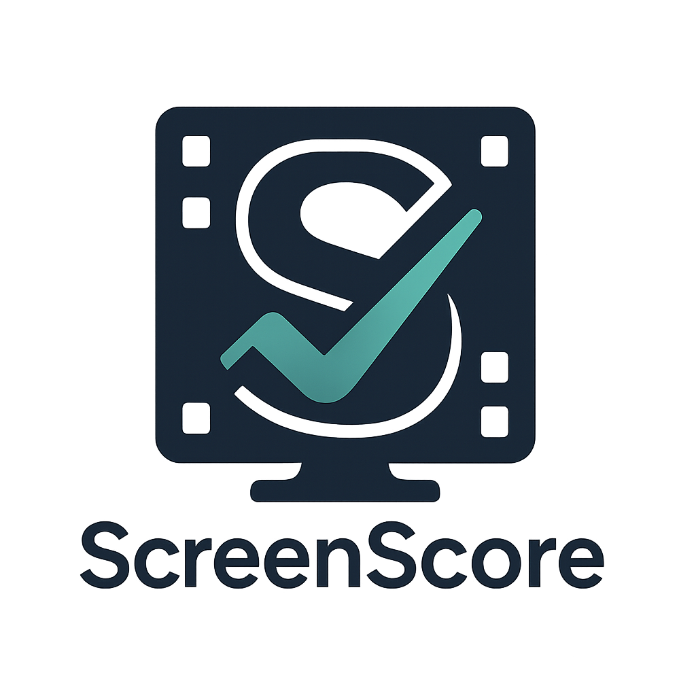

<p align="center">
  
</p>

# ScreenScore

**Local-first, private screenplay coverage.** Drop in a script, get professional-grade
coverage — logline, synopsis, a scored rubric with in-script evidence, character
breakdowns, comps, budget tier, content rating, and a Pass / Consider / Recommend
call — produced entirely by **local models on your machine**.

**Your script never leaves your computer.** No cloud, no accounts, no telemetry,
no outbound network calls during analysis. The only network activity ScreenScore
ever performs is a model download you explicitly start. That's the whole point:
writers and producers shouldn't have to upload unreleased IP to anyone's server
to get a serious read.

> **Status: v2 complete (Phases 1–5).** The full analysis pipeline is live
> (per-scene map pass → eight scored dimensions → synthesis → **citation
> verification**, with caching and crash resume), along with the product
> surface (evidence-to-script highlighting, annotations, project history,
> blind-scored cross-draft diffs) and PDF/Markdown/JSON export. Fast-follows
> on the roadmap: project export/import bundles and "Ask the script" chat.
> See [docs/DECISIONS.md](docs/DECISIONS.md) for the decision log.
>
> **Non-technical?** The friendly walkthrough lives on the
> [landing page](https://acharyaparth.github.io/ScreenScore/) (enable via
> GitHub Settings → Pages → deploy from `main`, `/docs` folder).

## Run it

### Docker (recommended)

```bash
git clone https://github.com/acharyaparth/ScreenScore.git
cd ScreenScore
docker compose up
```

Open **http://localhost:8686**.

**Models:** ScreenScore recommends a model pairing for your hardware on the
Analyze page. On **macOS**, install [Ollama](https://ollama.com) natively (free)
before `docker compose up` — the host app uses Apple's GPU; a container can't.
On **Linux**, the bundled Ollama container is used automatically; its port is
never exposed outside the compose network.

### Native (development)

Requirements: Python 3.12+, [uv](https://docs.astral.sh/uv/), Node 20+.

```bash
# backend — http://localhost:8686
cd backend && uv sync && cd ..
uv run --project backend uvicorn --factory screenscore.main:create_app --port 8686 --reload

# frontend (second terminal) — http://localhost:5173, proxies /api to 8686
cd frontend && npm install && npm run dev

# tests
cd backend && uv run pytest
```

## How it works

A mega-prompt over a 120-page script can't do what a coverage analyst does. v2
runs an explicit, inspectable pipeline instead:

```
ingest & parse → segment (scenes/acts) → map pass (small model, per scene)
  → dimension specialists (strong model) → synthesis → report JSON
```

- **Two-tier models, hardware-aware.** A fast 7–8B worker handles high-volume
  per-scene extraction; the strongest reasoning model your machine comfortably
  fits (14B/32B, 70B opt-in) handles scoring and synthesis. Weak hardware
  gracefully collapses to one small model — with an honest warning, never a failure.
- **Evidence or it didn't happen.** Every rubric score is categorical
  (Weak / Fair / Good / Excellent), carries a written rationale, and must cite
  scene numbers + quoted lines that are verified to exist in the script. A
  dimension without support says "insufficient evidence" instead of inventing a score.
- **It remembers — locally.** Projects, drafts, immutable reports, and your own
  annotations persist in SQLite plus a library folder under `data/`. Re-run a
  revised draft and ScreenScore scores it **blind** (no peeking at prior scores),
  then runs a separate diff pass to tell you what actually changed — including
  regressions. It will not flatter a revision.

### Repo layout

```
backend/    FastAPI engine: pipeline, model runtime, persistence, report schema
frontend/   React + Vite + Tailwind report UI
docs/       decisions log, assets
data/       (created at runtime, gitignored) SQLite DB + script/report library
```

The report contract is [`backend/screenscore/schemas/report.schema.json`](backend/screenscore/schemas/report.schema.json);
the API is browsable at `http://localhost:8686/api/docs` while running.

## Roadmap

| Phase | Scope | Status |
|-------|-------|--------|
| 1 | Skeleton & contracts: Docker one-liner, hardware-aware model recommendation, report + persistence schemas, stubbed end-to-end run | ✅ done |
| 2 | Rock-solid parsing: PDF / TXT / Fountain / FDX → structured scenes & characters | ✅ done |
| 3 | Real pipeline: map → specialists → synthesis, caching/resume, evidence verification | ✅ done |
| 4 | Report UI with evidence-to-script highlighting; project history; cross-draft diff | ✅ done |
| 5 | Exports (PDF/MD/JSON), landing page, polish, docs | ✅ done |
| — | Fast-follows: project export/import bundle, "Ask the script" chat | planned |

## Privacy, verifiably

- Analysis makes zero outbound calls — once models are pulled, ScreenScore runs
  with networking disabled. Verify it yourself: pull the models, turn off
  Wi‑Fi (or start the app container with `--network none` pointing at a local
  Ollama socket), and run a full analysis.
- The only outbound call in the entire codebase is the user-initiated model
  pull (`POST /api/models/pull` → your local Ollama, which fetches the model).
- The bundled Ollama's port is not published outside the Docker network.
- All state lives in `data/` on your disk. Delete the folder, and it's gone.

## License

[GPLv3](LICENSE). Contributions welcome — see [CONTRIBUTING.md](CONTRIBUTING.md).
